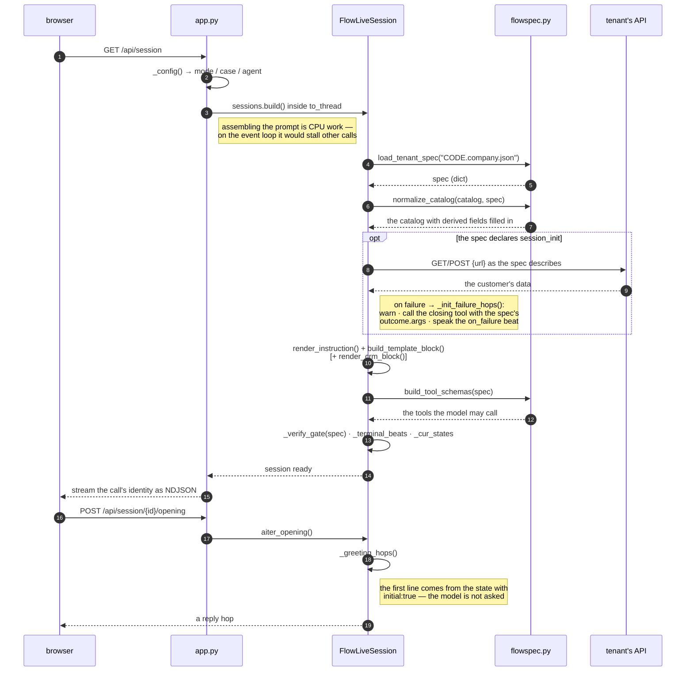
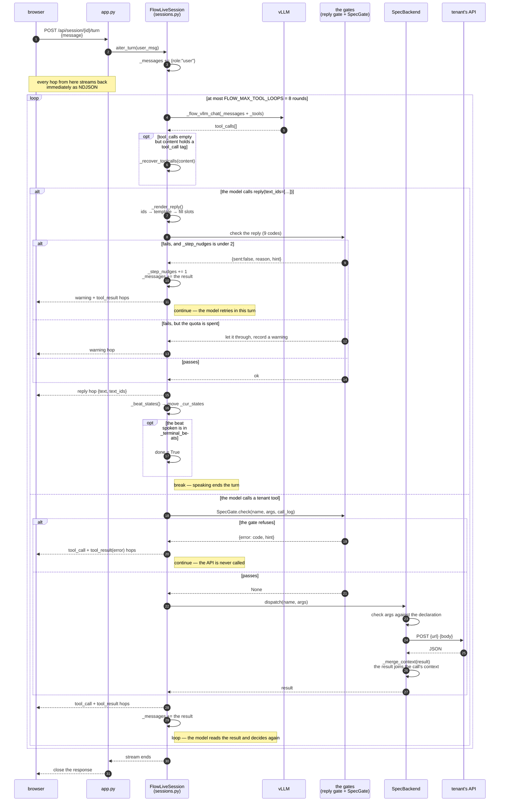
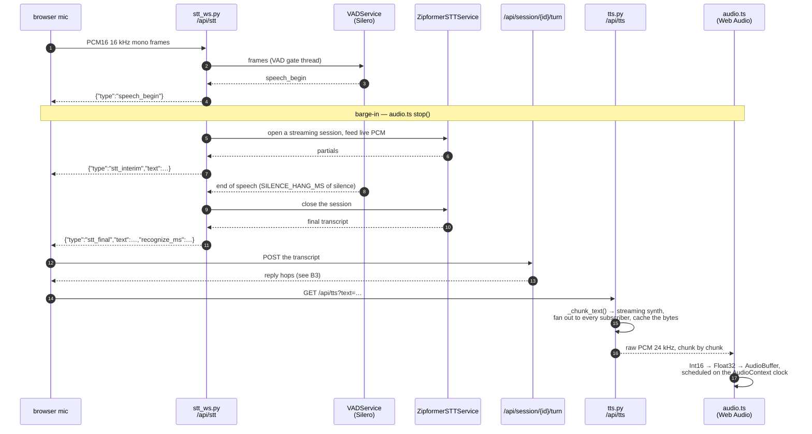

# How the Demo App Is Built

*(Authoring a spec: [MANUAL.md](MANUAL.md) · the file format: [SPEC_LOCKED.md](SPEC_LOCKED.md) · serving the model: [SERVING.md](SERVING.md))*

This document is in two parts, for two different readers:

| Part | For | Answers |
| ---- | --- | ------- |
| [**A · While demoing**](#a--while-demoing) | whoever runs or shows the demo | how the system works · what the screen is telling you · where to look when something is off |
| [**B · Handing over the code**](#b--handing-over-the-code) | the engineer taking it on | where the code is · which parts one turn passes through · which file to edit for what |

One principle decides everything below:

> What every tenant uses in common is **mechanism**, and it lives in the code.
> What differs between tenants is **policy**, and it lives in the spec file.
>
> So no company name, tool name, or beat name of any particular tenant appears in
> the app's code.

---

# A · While demoing

## A1 · The shape of it

```text
        ┌─────────────┐   what the caller says   ┌──────────────────────┐
        │   browser   │ ───────────────────────▶ │   app     :4100      │
        │             │ ◀─────────────────────── │  demo_v2.server.app  │
        └─────────────┘   streamed hops          └──────┬───────┬───────┘
                                                        │       │
                            ┌───────────────────────────┘       └──────────────┐
                            ▼                                                  ▼
                 ┌────────────────────┐                            ┌────────────────────┐
                 │  vLLM     :8001    │                            │  the tenant's API  │
                 │  decides            │                            │  does the real work│
                 └────────────────────┘                            └────────────────────┘
                            ▲
                            │ a prompt assembled from
                     ┌──────────────────────┐
                     │ <CODE>.company.json  │  ← everything that makes tenants differ
                     └──────────────────────┘
```

The model **does not compose sentences**. It picks the number of a sentence from the
store its tenant wrote; the app then looks that number up, fills in the customer's
data, and speaks it.

So every line the caller hears comes from a store the tenant approved in advance.

## A2 · What one turn does

```text
the caller speaks
   │
   ├─▶ ① the app sends the whole conversation + the prompt to the model
   │
   ├─▶ ② the model answers with a tool call, one of two kinds
   │        reply(text_ids=[…])   = it wants to speak
   │        <tool name>(…)        = it wants to act on data: verify identity, record a
   │                               promise to pay, and so on
   │
   ├─▶ ③ the app checks before letting it through
   │        passes  → speak / call the tenant's API
   │        fails   → hand the reason back and let the model fix it in the same turn
   │
   └─▶ ④ step ② repeats at most 8 times per turn
```

The model can chain several tools inside one turn — check the current time → record
the verbal commitment → record the payment date → then speak the closing line.

## A3 · What the app checks while you demo

There are two kinds of gate, each with its own job, and both read their rules from the
tenant's spec file. No company's policy is baked into the code.

**The reply gate** — the model has chosen what to say, and the app has not let it
speak yet.

| code | meaning |
| ---- | ------- |
| `unknown_text_id` | cites a sentence number that is not in this company's store |
| `verify_required` | about to say something that needs identity verified first |
| `missing_required_tools` | that state's steps are not all done yet |
| `incomplete_chain` | beats meant to be spoken together in one turn are not all there |
| `too_many_beats` | a beat that must stand alone was bundled with another |
| `empty_slot` | the sentence needs data this call does not have; letting it through speaks the placeholder |
| `date_format_invalid` | a date or time from the model is not in the required format |
| `tool_call_rejected` | the tool this line depends on failed, so it must not talk as if it succeeded |
| `closing_reply_required` | a result is recorded, so the next line has to be that result's farewell |

**The tool gate** — the model is about to act on data, and the app has not allowed it
yet.

| code | meaning |
| ---- | ------- |
| `call_already_closed` | the call is closed; no further tool may run |
| `<name>_already_recorded` | that tool runs once per call, and it already ran |
| `no_<name>` · `call_<name>_first` | wrong order — another tool has to succeed first |
| `commitment_mismatch` | a value does not match what an earlier step recorded |
| `missing_required_args` | an argument declared as required is absent |
| `value_not_offered` | an argument's value is not one of the options the system offered |
| `http_error` · `http_no_url` | the tenant's API did not answer, or the spec names no URL |

When a gate fires, the app **hands the reason back for the model to fix** rather than
cutting the conversation. The audience sees a warning strip on screen while the call
carries on.

## A4 · The voice path

Voice is a separate lane from the conversation logic: what the caller says becomes
text, the turn runs, and the reply becomes audio.

```text
mic ──▶ PCM16 16 kHz ──▶ Silero VAD ──▶ Zipformer ──▶ transcript ──▶ /turn
                          endpointing    self-hosted
                          + barge-in

reply text ──▶ Chirp 3 HD ──▶ raw PCM 24 kHz ──▶ Web Audio, chunk by chunk
```

What that means while presenting:

* **the caller can interrupt** — the VAD reports speech starting, and playback stops
* **words appear while the caller is still talking** — the recognizer streams partials
  and finalizes about 130 ms after they stop
* **the reply starts speaking before it is fully synthesized** — audio is scheduled as
  each chunk arrives instead of waiting for the whole clip
* **if the voice services are not configured, everything still works** — the STT socket
  reports a fatal error and the browser falls back to its own recognizer; without
  Google credentials `/api/tts` is silent and the conversation continues in text

## A5 · When something looks wrong, check in this order

| symptom | look at | meaning |
| ------- | ------- | ------- |
| the bot is silent / a blank message | the warning strip on screen | the reply gate fired repeatedly until the retry quota ran out |
| it speaks a placeholder like `[amount]` | the CRM Snapshot | this call has no data for that field |
| it never calls a tool | vLLM's tool-call parser | see [SERVING.md §4](SERVING.md) — it has returned empty while the model was emitting correctly |
| it skips a step | the Flow table in the instruction pane | the spec does not declare the order, so no gate can enforce it |
| unusually slow to answer | the vLLM log | the queue may be past capacity; see the Capacity table in [README.md](README.md) |
| no audio, or the caller is not heard | the browser console | the STT socket sent a fatal error, or TTS has no credentials |

---

# B · Handing over the code

## B1 · The files that carry the system

```text
demo_v2/server/sessions.py      one call's conversation: assemble the prompt · loop over
                                tool calls · the reply gate
demo_v2/server/flow/flowspec.py read and check a spec file · build the tool schemas
demo_v2/server/app.py           HTTP + NDJSON streaming — no call logic lives here
demo_v2/lib/prescript.py        fill data into a sentence: slots · voice gender · conditionals
```

Around them:

```text
server/flow/flowspec_render.py  spec → the instruction text the model reads
server/flow/spec_backend.py     run a tool for real: check args → HTTP → merge the result
                                into the call's context
server/flow/session_init.py     fetch the customer's data from the tenant's API before turn 1
server/flow/spec_gate.py        the tool gate — reads `gating` from the spec, nothing else
lib/datetime_utils.py           Thai dates and format checking
```

And the voice lane:

```text
server/stt_ws.py                the /api/stt WebSocket: VAD gate thread + streaming STT thread
server/tts.py                   Chirp 3 HD streaming proxy, with fan-out and a cache
services/speech/vad.py          VADService — Silero endpointing and barge-in
services/speech/zipformer_stt.py ZipformerSTTService — the self-hosted recognizer client
services/speech/stt.py          STTService — the Chirp alternative, imported only if selected
frontend/src/audio.ts           schedules PCM chunks on an AudioContext
frontend/src/sttSocket.ts       the browser end of the STT socket
```

## B2 · Opening one call



The same order as a call tree:

```text
GET /api/session
  └─ app.py create_session()          pick case / voice gender / model (in to_thread)
      └─ sessions.build()
          └─ FlowLiveSession.__init__()
               ├─ load_tenant_spec()            read <CODE>.company.json
               ├─ normalize_catalog()           fill in the catalog's derivable fields
               ├─ session_init                  if declared → call the API for customer data
               ├─ assemble the prompt  render_instruction() + build_template_block()
               │                       [+ render_crm_block()]
               ├─ build_tool_schemas(spec)      the tools the model may call
               ├─ _verify_gate(spec)            → (beats needing verification, the unlock)
               └─ _terminal_beats               beats that end the call when spoken
POST /api/session/{id}/opening
  └─ _greeting_hops()                 the opener comes from the initial state, not the model
```

## B3 · One turn

`FlowLiveSession._aiter_run()`, at most `FLOW_MAX_TOOL_LOOPS = 8` rounds:



`_step_nudges` is a per-call quota, not a per-turn one, so the "fails, but the quota is
spent" path above can be reached from the third turn onward if the first two used it.

The same loop as code:

```text
for _loop in range(8):
    _flow_vllm_chat()                 call vLLM (urllib, not a vendor SDK)
    tcs = tool_calls from the answer
      └─ empty → _recover_toolcalls()  dig <tool_call>{…}</tool_call> out of content
    if it is "reply":
        _render_reply()               ids → text → fill slots
        the reply gate, 9 codes       fails → put the result in _messages and continue
        _beat_states()                the beat spoken → the states holding it → _cur_states
        that beat is in _terminal_beats → self.done = True
        break                         speaking ends the turn
    otherwise:
        SpecGate.check()              the tool gate (reads `gating` from the spec)
        SpecBackend.dispatch()        check args → _dispatch_http → _merge_context
        the result joins _messages    the model reads it and decides again next round
```

## B4 · The voice lane

Two sockets, independent of the conversation loop. Neither knows anything about flows,
specs, or beats — they move audio.



Details that matter when touching this:

| | |
| --- | --- |
| VAD owns endpointing, not the recognizer | `SILERO_THRESHOLD` · `SILENCE_HANG_MS` · `MIN_SPEECH_MS` are the knobs, all env-overridable |
| two worker threads | the VAD gate must never be blocked by the recognizer, or end-of-speech is detected late |
| the recognizer is the tenant's own server | `AAX6_ZIPFORMER_URL`; `STTService` (Chirp) stays as an alternative behind `AAX6_STT_ENGINE` |
| audio is headerless PCM, never a container | an `<audio>` element cannot play it — that is the point: no demux, no codec start-up, so first audio lands in ~140 ms instead of ~1.4 s |
| one synth, many subscribers | `prefetch(text)` and the `play(text)` that follows share a single gRPC stream, and the producer is detached so a barge-in still fills the cache |
| torch and the STT engines import lazily | importing `demo_v2.server.app` must stay light; the app runs with none of them installed |

## B5 · What the code holds to without saying so

| principle | detail |
| --------- | ------ |
| the model writes no text | every line comes from `catalog.template`; even `_fallback_reply()` picks from the store |
| no tenant's names in the code | company, tool, and beat names live in the spec file — needing an `if company == …` means the mechanism is not general enough yet |
| no rule, no gate | `SpecGate` finding no rule means allow, not deny |
| position comes from what was spoken | `_cur_states` moves on the beat the app **actually spoke**, not on an event label for the customer — a real call has none |
| closing takes two steps | the tool declaring `required_at: end_of_call` records the result and locks out further tools; the call ends when a **terminal state's beat is spoken** (`done = True`), and the farewell must match the recorded result |
| the app never calls a tool itself | every call comes from the model, with one exception — `_init_failure_hops()`, when `session_init` does not answer and there is no conversation to judge |
| the prompt is rebuilt every call | nothing pre-rendered is stored, so a spec edit takes effect on the next call |

## B6 · Where to change what

| to change | edit |
| --------- | ---- |
| add a tenant · change wording · change the order | `data/flows/<CODE>.company.json` — no code |
| add or change a reply gate | `sessions.py::_aiter_run`, the `fn["name"] == "reply"` branch |
| add or change a tool gate | `flow/spec_gate.py::check()` — it must be driven by a spec key, not a tool name |
| the prompt's shape | `flow/flowspec_render.py` (the instruction) · `lib/prescript.py::build_template_block` (the template block) |
| a new spec key | `flow/flowspec.py` — `TOP_KEYS`/`STATE_KEYS`/… then update `SPEC_LOCKED` in both languages |
| slot filling · Thai dates | `lib/prescript.py` · `lib/datetime_utils.py` |
| endpointing, barge-in | `server/stt_ws.py` · `services/speech/vad.py` |
| synthesis, playback | `server/tts.py` · `frontend/src/audio.ts` |
| the web UI | `demo_v2/frontend/src/`, then `pnpm build` |

## B7 · Before handing anything over

```bash
python3 -m pytest -q
python3 tools/check_doc_matches_code.py
cd demo_v2/frontend && npx tsc --noEmit
```

These three cover what tends to break without showing it:

* the example in the manual still uploads through the app's real path
* the documents still match the constants in the code
* the prompt has no duplicated heading and no unreachable beat

> **One run is not evidence of stability.**
> The same machine, the same build, the same day has produced different scores. Measure
> at least three times and report the range.
