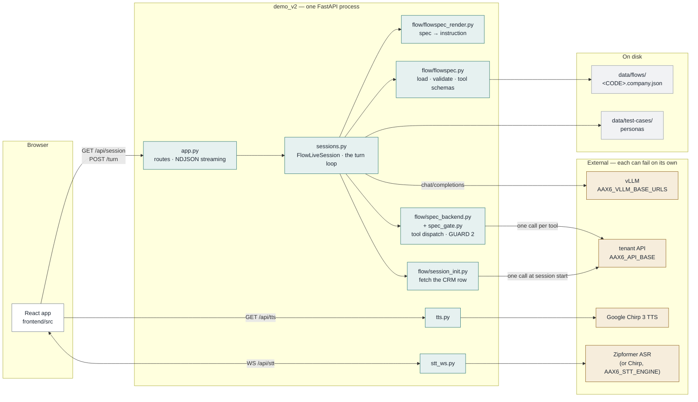
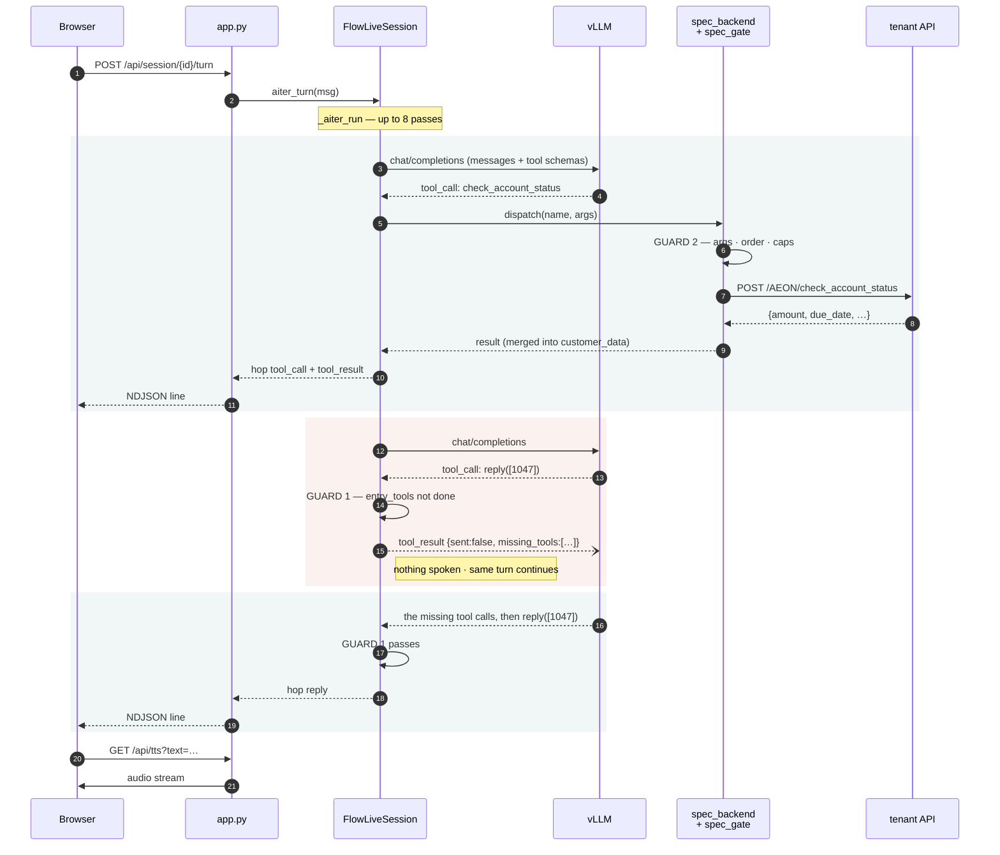
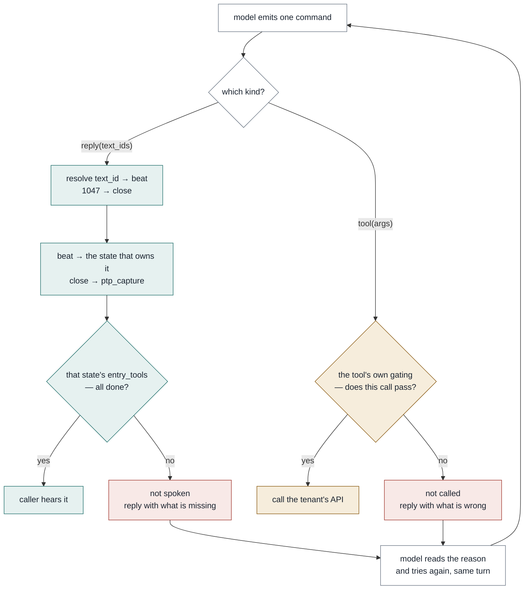

# demo_v2 in three diagrams

Companion to [CODE_MAP.md](CODE_MAP.md), which is the prose version.

1. [Architecture](#1--architecture) — what talks to what
2. [Sequence](#2--sequence-one-customer-turn) — one customer turn, end to end
3. [Decision flow](#3--decision-flow-one-model-command) — what happens to one model command

Every box and arrow here was checked against the source. GitHub renders these; in a
terminal, read [CODE_MAP.md](CODE_MAP.md) instead.

---

## 1 · Architecture

Four things are outside this service and can each fail independently: the model, the
tenant's API, and the two speech engines.



Worth noticing:

- **The tenant's API is reached from two places** — once by `session_init` when the call
  opens, then once per tool by `spec_backend`. Nothing else in the process talks to it.
- **Nothing holds a database.** State for a call lives in the `FlowLiveSession` object;
  the tenant's system is the record.
- **Voice is a side branch.** `tts.py` and `stt_ws.py` never touch `sessions.py` — pull
  them out and the call still runs, silently.
- **`data/flows/` is the whole product surface.** Dropping in a file adds a company.

---

## 2 · Sequence: one customer turn

What happens between the caller finishing a sentence and hearing the next one.
The dotted return is the part people miss: a rejection goes back to the model as a
tool result, inside the same turn.



The loop bound is `FLOW_MAX_TOOL_LOOPS = 8`. If it runs out with nothing spoken,
`_fallback_reply()` says the tenant's fallback line rather than leaving the line silent.

---

## 3 · Decision flow: one model command

The model emits one command at a time. This is the whole of what the app does with it.



| | GUARD 1 — before speaking | GUARD 2 — before writing |
|---|---|---|
| stops | an incomplete or out-of-order sentence | wrong data reaching the tenant's system |
| cost of being wrong | the caller hears something odd; fixable next turn | written, and not retractable |
| ceiling | 2 nudges per turn, then let through | none — refused every time |
| where the rules come from | the state that owns the beat | the tool's own `gating` |
| does the app know the domain | no | no |

Guard 1 lets a reply through after two nudges because the person on the line is real,
and dead air is worse than an imperfect sentence. Every time it does, it logs a warning.

---

## Keeping these honest

The three diagrams describe code that changes. If you edit the flow, check these:

```bash
grep -n "FLOW_MAX_TOOL_LOOPS" demo_v2/server/sessions.py     # the loop bound in §2
grep -n "def dispatch"        demo_v2/server/flow/spec_backend.py   # GUARD 2's entry
grep -n "_step_nudges < 2"    demo_v2/server/sessions.py     # GUARD 1's ceiling
grep -rn "AAX6_API_BASE"      demo_v2                        # who reaches the tenant API
```

The last one is the check that matters most for §1: if it returns something outside
`session_init.py` and `spec_backend.py`, the architecture diagram is out of date.
